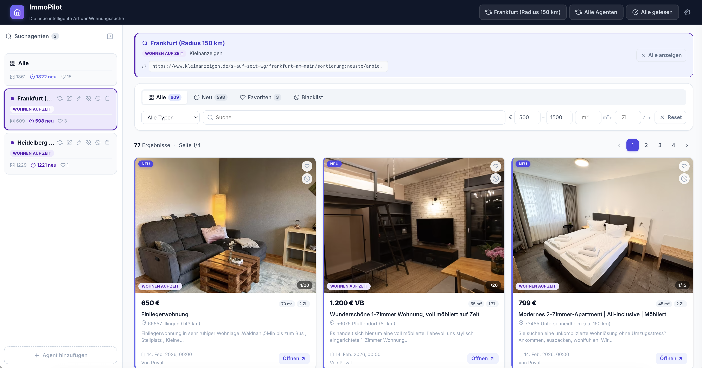

# ImmoPilot

Apartment hunting wastes a lot of time – mostly because the same listings keep appearing with every new search. ImmoPilot remembers what you've already seen or dismissed, and filters it out next time. Over time, the feed gets shorter and more targeted.

Currently supported: **Kleinanzeigen** – more providers to come.


---



---

## Quickstart

Requires Node.js 22.5+.

```bash
npm install
npm run build:client
npm start
```

→ http://localhost:3000

---

## Features

- 🔍 **Search agents** – multiple agents, each with its own search URL from the provider and a page limit
- 🚫 **Blacklist** – per click or globally via keywords
- ❤️ **Favorites** – persisted even if the agent is deleted
- 🔄 **Scraping** – manual, on startup, or via cron; with pagination and duplicate filtering
- 🧩 **Provider system** – currently: Kleinanzeigen; more planned
- 🗄️ **Local** – SQLite

---

## Configuration

Everything is optional – works without a `.env` file.

| Variable | Default | Purpose |
|---|---|---|
| `PORT` | `3000` | HTTP server port |
| `SCRAPE_ON_START` | `false` | Scrape on startup |
| `SCRAPE_CRON_ENABLED` | `false` | Cron-based scraping |
| `SCRAPE_CRON` | `*/30 * * * *` | Cron expression |

Keyword blacklist in `config/default.json`:

```json
{
  "blacklistKeywords": ["Monteurszimmer", "Zwischenmiete", "wg", "Monteur", "Untervermietung"]
}
```

---

## Data Model

`data/listings.db` is created automatically.

- **`listings`** – listings with price, size, address, timestamps and flags (`is_seen`, `is_favorite`, `is_blacklisted`)
- **`search_configs`** – search agent configurations
- **`scrape_runs`** – run history per agent
- **`blacklist`** – permanent exclusions by ID or URL

---

## Architecture

```
client/                   React frontend (Vite)
  src/components/         UI components (cards, filter, sidebar, …)
  src/hooks/              Data fetching & state (useListings, useScraper, …)

src/                      Express backend
  server.js               Entry point, middleware, routes
  routes/                 listings, scraper, configs
  scrapers/engine.js      Playwright runner + CSS selector config
  providers/              Adapter registry + Kleinanzeigen implementation
  services/               Scrape orchestration per agent
  db/database.js          node:sqlite – schema, migrations, upserts

config/default.json       Keyword & neighborhood blacklist
data/listings.db          SQLite file (auto-created)
```

---

## API

```
GET    /api/listings                   Fetch listings (filter via query params)
PATCH  /api/listings/:id/seen          Mark as seen
PATCH  /api/listings/:id/favorite      Toggle favorite
POST   /api/listings/:id/blacklist     Blacklist listing
DELETE /api/listings/:id/blacklist     Remove from blacklist
POST   /api/scrape                     Scrape all active agents
POST   /api/scrape/:configId           Scrape a single agent
GET    /api/configs                    Get agents
POST   /api/configs                    Create agent
GET    /api/providers                  List available providers
```

---

## DB Scripts

```bash
npm run db                 # Overview
npm run db listings        # Print listings
npm run db runs            # Print scrape runs
npm run db sql "SELECT …"  # Run arbitrary SQL
```

---

## Notes

For private use only.

---

## License

[Apache 2.0](LICENSE)
