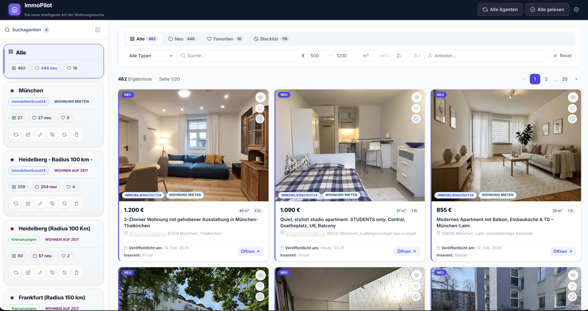

# Immo-Pilot


### Your smart hub for apartment hunting — all portals, one place.

Apartment hunting wastes a lot of time – mostly because the same listings keep appearing with every new search. Immo-Pilot remembers what you've already seen or dismissed, and filters it out next time. Over time, the feed gets shorter and more targeted.


Immo-Pilot aggregates listings from multiple real estate platforms into a single, unified interface. Instead of jumping between portals and losing track of what you've already seen, Immo-Pilot continuously scrapes your configured sources, deduplicates results, and presents everything in one clean dashboard — so you never miss the perfect apartment again.


Currently supported: **ImmobilienScout24** & **Kleinanzeigen** – more providers to come.


---



---


## Features

- 🔍 **Search agents** – multiple agents, each with its own search URL from the provider and a page limit
- 🚫 **Blacklist** – per click or globally via keywords
- ❤️ **Favorites** – persisted even if the agent is deleted
- 🧾 **Listing detail view** – open a listing to see provider details: rent breakdown, descriptions, amenities, energy data, address, contact info, image gallery, and original attribute groups
- 🗺️ **Location map** – shows the listing location with Leaflet/OpenStreetMap, and uses cached Nominatim lookups when exact provider coordinates are missing or listings only expose postcode, district, or city-level address data
- 🔄 **Scraping** – manual, on startup, or via cron; with pagination and duplicate filtering
- 🧩 **Provider system** – currently: **ImmobilienScout24** & **Kleinanzeigen**; more planned
- 🗄️ **Local** – SQLite

## Quickstart

Requires Node.js 22.5+.

```bash
npm install
npm run build:client
npm start
```

→ http://localhost:3000

---

## Configuration

Everything is optional – works without a `.env` file.

| Variable | Default | Purpose |
|---|---|---|
| `PORT` | `3000` | HTTP server port |
| `SCRAPE_ON_START` | `false` | Scrape on startup |
| `SCRAPE_CRON_ENABLED` | `false` | Cron-based scraping |
| `SCRAPE_CRON` | `*/30 * * * *` | Cron expression |
| `NOMINATIM_USER_AGENT` | `Immo-Pilot/1.0 local detail map resolver` | User-Agent for OpenStreetMap Nominatim geocoding requests |

Keyword blacklist in `config/default.json`:

```json
{
  "blacklistKeywords": ["Monteurszimmer", "Zwischenmiete", "wg", "Monteur", "Untervermietung"]
}
```

---

## Data Model

### Table `listings`
One row per unique listing, deduplicated by provider ID. Stores all scraped content plus user state (`is_seen`, `is_favorite`, `is_blacklisted`). Tracks when a listing was first and last seen and its position in the most recent scrape.

```
id · source · title · price · size · rooms · address · description · publisher
lat · lon · link · image · images · provider · listing_type
is_seen · is_favorite · is_blacklisted · blacklisted_at · favorited_at
first_seen · last_seen · listed_at · available_from · scrape_rank
```

### Table `listing_details`
Cached provider detail data for the listing detail view. Details are fetched on demand for ImmobilienScout24 and Kleinanzeigen. Stores normalized values for availability, rent, amenities, energy data, descriptions, address, coordinates, contact data, gallery image URLs, grouped attributes, and the raw provider response.

```
listing_id · provider · expose_id · fetched_at · source_version · status · error
available_from · available_from_source
cold_rent · warm_rent · service_charge · deposit · price_per_sqm
floor · bedrooms · bathrooms · pets
has_kitchen · has_cellar · has_balcony · has_garden · has_lift · barrier_free
construction_year · condition · heating_type · energy_carrier · energy_class · energy_value
description · location_description · address_line1 · address_line2 · lat · lon
agent_name · contact_phone_numbers · contact_available
images · attribute_groups · raw_detail_json
```

### Table `map_location_cache`
Cache for map lookups used by the listing detail view. Provider coordinates are used directly when they are exact; listings without exact coordinates, or with only postcode, district, or city-level address data, are resolved through Nominatim and cached by query, including misses.

```
query · fetched_at · status · source · label · precision
lat · lon · bbox_json · geometry_geojson
```

### Table `search_configs`
One row per search agent. Defines provider, listing type, page limit, search URL, and enabled state.

```
id · name · provider · listing_type · max_pages · extra_params · enabled · created_at
```

### Table `listing_agents`
Junction table linking listings to the agents that found them (n:m). Records the rank within that agent's run and which run last actively scraped the listing.

```
listing_id · search_config_id · scrape_rank · last_scraped_run_id
```

### Table `scrape_runs`
Log of every scrape execution with timing, counts, and error info.

```
id · source · provider · listing_type · search_config_id
started_at · ended_at · status · new_count · total_count · error
```

### Table `blacklist`
Blocked listing IDs or URLs, including keyword-based blocks that have no matching listing row.

```
id · listing_id · url · created_at
```

---

## Architecture

```
client/                   React frontend (Vite)
  src/components/         UI components (cards, filter, sidebar, detail panel, map, …)
  src/hooks/              Data fetching & state (useListings, useScraper, …)

src/                      Express backend
  server.js               Entry point, middleware, routes
  routes/                 listings, scraper, configs
  scrapers/engine.js      Playwright runner + CSS selector config
  providers/              Adapter registry + provider implementations
  services/               Scrape orchestration per agent, map-location resolution
  utils/                  Shared parsing and map-location helpers
  db/database.js          node:sqlite – schema, migrations, upserts

config/default.json       Global blacklist keyword config
data/listings.db          SQLite file (auto-created)
```

---

## API

```
GET    /api/listings                      Fetch listings (filter via query params)
GET    /api/listings/stats                Aggregate listing counters
GET    /api/listings/stats/per-config     Listing counters per agent + orphan stats
GET    /api/listings/runs                 Recent scrape runs
PATCH  /api/listings/seen-all             Mark all listings as seen
PATCH  /api/listings/:id/seen             Mark a listing as seen
PATCH  /api/listings/:id/unseen           Mark a listing as unseen
PATCH  /api/listings/:id/favorite         Toggle favorite
POST   /api/listings/:id/blacklist        Blacklist a listing
DELETE /api/listings/:id/blacklist        Remove listing from blacklist
DELETE /api/listings/reset                Delete unpinned listings
DELETE /api/listings/reset/:configId      Delete unpinned listings for one agent
DELETE /api/listings/clear-favorites      Clear all favorites
DELETE /api/listings/clear-favorites/:configId
                                          Clear favorites for one agent
DELETE /api/listings/clear-blacklist      Clear blacklist flags
DELETE /api/listings/clear-blacklist/:configId
                                          Clear blacklist flags for one agent
GET    /api/listings/:id/images           Fetch or return cached gallery image URLs
GET    /api/listings/:id/details          Fetch or return cached listing details
POST   /api/listings/:id/details/refresh  Refresh provider detail data
GET    /api/listings/:id/map-location     Resolve a normalized map location
POST   /api/listings/batch-images         Batch image fetch for listing cards

GET    /api/configs                       Get agents
POST   /api/configs                       Create agent
PATCH  /api/configs/:id                   Update agent
DELETE /api/configs/:id                   Delete agent
POST   /api/configs/infer-url             Infer provider + listing type from URL

POST   /api/scrape                        Scrape all active agents
POST   /api/scrape/:configId              Scrape a single enabled agent
POST   /api/scrape/stop                   Cancel a running scrape
GET    /api/scrape/status                 Current scrape progress
GET    /api/scrape/config                 Read global scrape config
PATCH  /api/scrape/config                 Update global scrape config

GET    /api/providers                     List available providers
```

---

## DB Scripts

```bash
npm run db                 # Overview
npm run db listings        # Print listings
npm run db runs            # Print scrape runs
npm run db sql "SELECT …"  # Run arbitrary SQL
```

---

## Notes

For private use only.

---

## License

[Apache 2.0](LICENSE)
